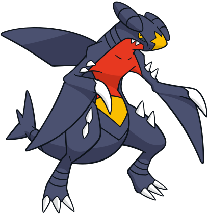
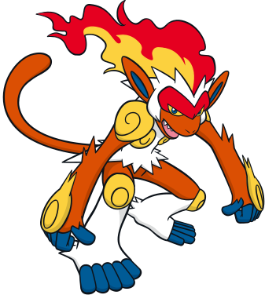
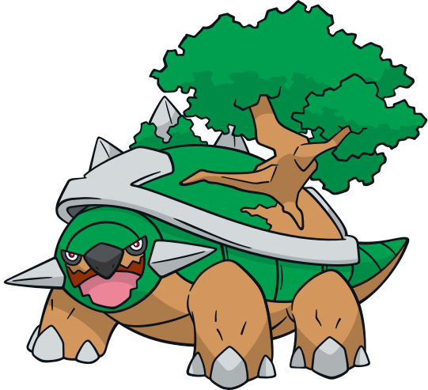
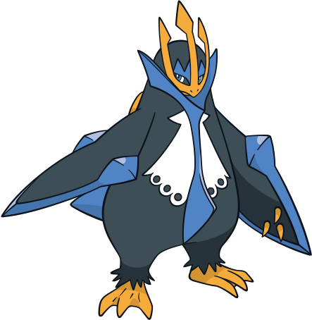
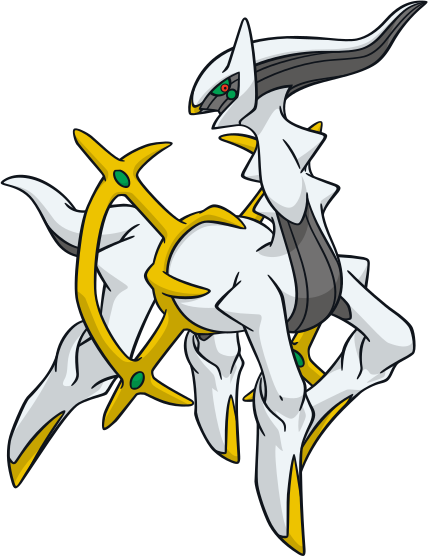

#  PokeSim – Gen 4 Pokémon Battle Simulator

## 🌐 Live Demo

[🚀 Try the App](https://poke-sim-two.vercel.app)

- Frontend: https://poke-sim-two.vercel.app  
- Backend API: https://pokesim-backend.onrender.com/docs  

---

---

This repo is my attempt at creating a small Pokémon battle simulator that focuses on **Gen 4 Pokémon only** at the beginning. Since then, it has grown into a full team builder with account-based saved teams, though Gen 4 is still the only generation supported.  

---

##  What This Project Is

- A Gen 4–only Pokémon battle simulator (for now)  
- A learning project for frontend ↔ backend connection  
- A place to experiment with:
  - Team building  
  - Damage calculation  
  - Turn-based battle logic  

---

##  Tech Stack

- **Frontend:** React (Create React App)  
- **Backend:** Python + FastAPI  
- **Database & Auth:** Supabase (Postgres + Row Level Security for per-account data isolation)  
- **API:** REST API (JSON requests & responses)  
- **Hosting:**  
  - Vercel (frontend)  
  - Render (backend)  

---

##  Core Features

- **Pokedex & Team Builder:**
  - Browse, search, and filter all 107 Gen 4 Pokémon  
  - Drag and drop to assemble a team, reorder, or swap slots  
  - Configure nickname, level, ability, and moveset per Pokémon  

- **Saved Teams & Accounts:**
  - Register and log in  
  - Save, load, and edit teams privately per account  
  - Row Level Security (Supabase) ensures only you can see or touch your own saved teams  
  - Password reset  

- **Battle System:**
  - Turn-based battle flow  
  - Move selection, switching, running  
  - HP + EXP system  

- **Rogue Mode:**
  - Wild Pokémon scale based on your team  
  - Wave progression system  
  - Between-battle healing  

- **Frontend ↔ Backend Integration:**
  - Frontend sends actions (move, switch, run)  
  - Backend processes logic  
  - Returns updated battle state  

---

##  How It Works

- React UI sends requests → FastAPI backend  
- Backend calculates battle logic  
- Returns updated Pokémon stats + logs  
- UI updates instantly  

---

##  Current Status

- Backend fully deployed on Render  
- Frontend deployed on Vercel  
- Frontend connected to live backend  
- Battle system fully working (start, move, switch, run)  
- Rogue mode implemented with scaling enemies  
- Full Gen 4 Pokedex live, with a Team Builder supporting drag-and-drop assembly  
- Saved Teams and accounts live, backed by Supabase with Row Level Security  

---

##  Future Ideas

- Expand to more Pokémon generations  
- Add more move effects + status conditions  
- More UI polish and animation, building on the drag-and-drop Team Builder  
- Multiplayer / PvP mode  

---
